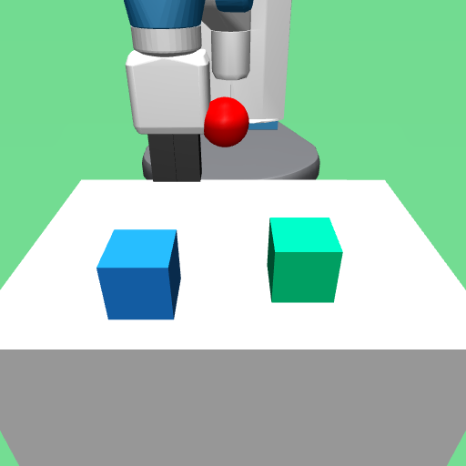

# Multi-object Fetch

Visual RL environments for multi-object reasoning and manipulation with a Fetch robot. 
The following table shows examples of the different environments (Reach, Push, and Pick) as well as the relational
reasoning tasks (Red, Reddest, Odd, OddGroups).

|           |                             Red                             |                            Reddest                             |                           Odd                            |                           OddGroups                            |
|:----------|:-----------------------------------------------------------:|:--------------------------------------------------------------:|:--------------------------------------------------------:|:--------------------------------------------------------------:|
| **Reach** |   |  |  |  |
| **Push**  |    |     |   |   |
| **Pick**  |    |     |   |   |

## Installation
The easiest way to install is to use the provided `create_conda_env.sh` script. This creates a conda environment called `mof` with all the necessary dependencies, sets up MuJoCo and copies asset files.
```
./create_conda_env.sh
source ~/.bashrc
conda activate mof
```

## Getting Started
To verify that the installation was successful, environments can be run with a random or user-controlled policy. An example command to control the robot on a pick-and-place task is:
``` 
python examples/run.py --policy user --task Odd --num_distractors 2 --environment Pick
```


The following arguments are used to configure the environments and can be tested in `examples/run.py`:
- `policy`: Whether to control the agent via the keyboard or run a random policy be in `random`, `user`.
- `environment`: Selects the environment to run and can be in `Reach`, `Push`, and `Pick`.
- `task`: Selects which task to run and can be in `Red`, `Reddest`, `Odd`, and `OddGroups`.
- `num_distractors`: Number of distractor targets/blocks to use in the environment.

## Credits
This repository is an extension of the environments in [fetch-block-construction](https://github.com/richardrl/fetch-block-construction).